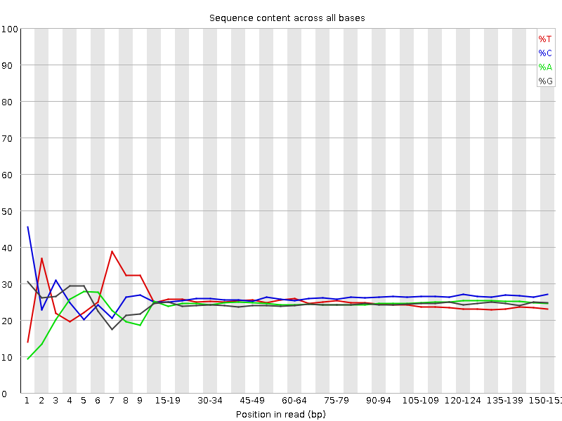
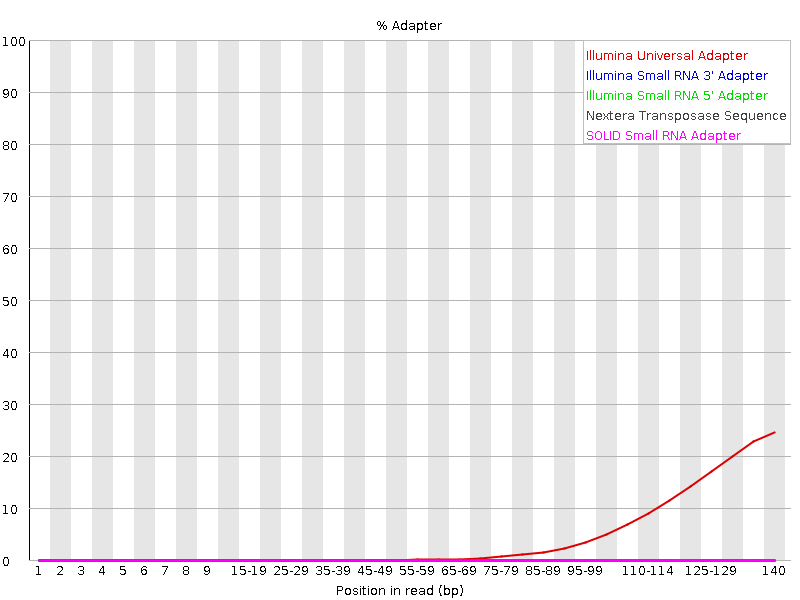

# Introduction

[SEAsnake](https://github.com/BIGslu/SEAsnake) is a [snakemake](https://snakemake.readthedocs.io/en/stable/) pipeline to process bulk RNA-seq data from fastq sequences to gene counts. It includes the following steps. You can seen an in-depth example of how to run these steps separately outside SEAsnake in our [first tutorial](https://github.com/BIGslu/tutorials/blob/main/RNAseq/1.Hawn_RNAseq_fastq.to.counts.pdf).

1. Quality assess sequences with [FastQC](https://www.bioinformatics.babraham.ac.uk/projects/fastqc/)
2. Remove adapters and filter low quality sequences with [AdapterRemoval](https://adapterremoval.readthedocs.io/en/latest/)
    - max N = 1
    - min length = 15
    - min quality = 30
    - 5' and 3' adapters specified in config file
3. Align to reference genome with [STAR](https://github.com/alexdobin/STAR)
4. Quality filter alignments with [samtools](http://www.htslib.org/) `view`
    - header retained
    - paired reads where both mapped
    - min MAPQ = 30
    - remove unmapped, non-primary alignments, and PCR duplicates
5. Quality assess alignments with [samtools](http://www.htslib.org/) `flagstat` and/or [Picard](https://broadinstitute.github.io/picard/) `CollectRnaSeqMetrics`
6. Count reads in genes with [Subread](http://subread.sourceforge.net/) `featureCounts`
    - exons only
  
Here, we provide an example of how to install and run SEAsnake on human bulk RNA-seq.

# Software
## Resource requirements

**RAM**: Indexing the human genome requires a minimum of 40 GB of RAM. If your reference genome is smaller or you already have a built index, you may be able to use less RAM. If you have many samples, you may need to use more RAM. The most common pipeline failure is running out of RAM so when in doubt, choose the larger option.

**CPU**: We recommend at least 1 CPU per sample to a minimum of 8 CPUs for this pipeline. More CPU usage will increase RAM usage, so if you have limited RAM, scale down the number of CPUs used.

**Storage**: SEAsnake itself is a small program (< 150 MB). Thus, storage needs depend almost entirely on your sample size and sequencing depth of those samples. We recommend 65 GB of storage per 10 fastq files to be run. This comes to roughly 1 TB for 150 fastq or 75 paired-end samples.

## AWS installation

SEAsnake can be pre-installed on any AWS EC2 instance.

1. Launch a new instance from the AWS console. Search 'seasnake' and select the Community AMI SEAsnake.
2. Choose your instance type keeping your resource requirements in mind. `c5` types are our most used class. For this tutorial's data, use `r5a.2xlarge`
3. Leave configuration as defaults.
4. Add additional EBS storage to hold your data and results. Please leave the root storage as 16 GB; this holds the underlying software. 
5. Tag your instance if desired.
6. Configure security as you normally would. 
7. Launch the instance. This will take a couple minutes to complete before you can log-in.

Once the instance is running, log-in and complete setup as follows. First, define your AWS account information.

```{bash eval=FALSE}
AWS_ACCESS_KEY="XXXX"
AWS_SECRET_ACCESS_KEY="XXXX"
AWS_REGION="xxxx"
```

Then, run the following script.

```{bash eval=FALSE}
#### Basic AWS update ####
sudo yum upgrade -y
sudo yum update -y

#### Configure AWS ####
## Configure your account
export AWS_ACCESS_KEY_ID=$AWS_ACCESS_KEY
export AWS_SECRET_ACCESS_KEY=$AWS_SECRET_ACCESS_KEY
export AWS_DEFAULT_REGION=$AWS_REGION

## Setup fuse keys
echo $AWS_ACCESS_KEY:$AWS_SECRET_ACCESS_KEY > ~/.passwd-s3fs
chmod 600 ~/.passwd-s3fs

#### Setup EBS volume ####
## Get addtl volume name
## If this does not give the correct volume name, find it with lsblk
ebs_name=$(lsblk -o NAME -n -i -r | tail -n 1)
echo $ebs_name
## Format volume
sudo mkfs -t ext4 /dev/$ebs_name
## Attach SEAsnake directory to volume
sudo mount --bind /dev/$ebs_name ~/SEAsnake/
## Change permissions to read-write
sudo chmod 777 -R ~/SEAsnake/

## Clone SEAsnake from GitHub
git clone https://github.com/BIGslu/SEAsnake ~/SEAsnake
```

## Other linux installation

If you are not using AWS, you can install SEAsnake and its dependencies using the following scripts.

```{bash eval=FALSE}
#### Install conda ####
## Download conda
sudo mkdir -m 777 -p ~/apps/anaconda
cd ~/apps/anaconda
sudo curl -O https://repo.anaconda.com/archive/Anaconda3-2021.11-Linux-x86_64.sh

## Compile and install conda
sudo bash Anaconda3-2021.11-Linux-x86_64.sh -b -p /home/ec2-user/apps/anaconda -u
eval "$(/home/ec2-user/apps/anaconda/bin/conda shell.bash hook)"
conda init
sudo chmod 777 -R ~/apps/
```

Restart your terminal for conda initiation to take effect.

```{bash eval=FALSE}
## Configure addtl conda channels
conda config --add channels bioconda
conda config --add channels conda-forge
conda config --set allow_conda_downgrades true

#### Install mamba ####
conda install -n base -c conda-forge mamba -y --repodata-fn repodata.json

#### Install SEAsnake ####
## Install git
sudo yum install git -y

## Clone SEAsnake from GitHub
sudo mkdir -m 777 ~/SEAsnake
git clone https://github.com/BIGslu/SEAsnake ~/SEAsnake

## Create environment and install SEAsnake software with mamba
mamba env create --name SEAsnake --file ~/SEAsnake/environment/Hissss_env.yaml
```

## Updating SEAsnake

If you previously installed SEAsnake, you can update it by pulling the latest version from GitHub.

```{bash eval=FALSE}
cd ~/SEAsnake
git pull
```

# SEAsnake
## fastq data

*Note: SEAsnake is only setup to run paired-end `fastq.qz` files in its `data/` directory.*

If you are using fuse to access your fastq data on S3, link your bucket to the SEAsnake `data/` directory.

```{bash eval=FALSE}
# Define the name of your data bucket
DATA_BUCKET="MY_BUCKET_NAME"
# Make directory for data
sudo mkdir -m 777 ~/SEAsnake/data
# Fuse bucket to directory
s3fs $DATA_BUCKET ~/SEAsnake/data \
    -o passwd_file=~/.passwd-s3fs \
    -o default_acl=public-read -o uid=1000 -o gid=1000 -o umask=0007
```

If you are transferring data by another method, create the `SEAsnake/data/` directory and copy your data there. For example, to run this vignette's data.

```{bash eval=FALSE}
# Make directory for data
sudo mkdir -m 777 ~/SEAsnake/data
# Copy fastqs
cp ~/SEAsnake/vignette/data/*fastq.gz ~/SEAsnake/data
```

## Reference genome

If you are using fuse to access your STAR-formatted genome index on S3, link your bucket to the SEAsnake `ref/` directory. *Hawn/Altman labs: These are in the bucket `human-ref`.*

```{bash eval=FALSE}
# Define the name of your data bucket
REF_BUCKET="MY_BUCKET_NAME"
# Make directory for data
sudo mkdir -m 777 ~/SEAsnake/ref
# Fuse bucket to directory
s3fs $REF_BUCKET ~/SEAsnake/ref \
    -o passwd_file=~/.passwd-s3fs \
    -o default_acl=public-read -o uid=1000 -o gid=1000 -o umask=0007
```

If you do not have a pre-built index, the pipeline will make one for you!

## Run SEAsnake

Set the number of threads you would like to use. This should be no more than your total CPU - 1. Then, activate the conda environment, which contains all pre-installed software.

```{bash eval=FALSE}
threads=15
conda activate SEAsnake
```

### Step 1

Next, run SEAsnake step 1. This completes initial sequence quality assessment, directory structure setup, and config file creation. *Note that `nohup` and piping into a log file means nothing will appear in your terminal window. This prevents timeout and retains all messages and errors in the log.*

```{bash eval=FALSE}
nohup snakemake --snakefile Snakefile_step1 --cores $threads >> log/SEAsnake_step1.log 2>&1
```

Your directory structure will look like

```{r eval=TRUE, echo=FALSE, message=FALSE, fig.height=6}
#You do not need to run this. See HTML or PDF document for figure.
library(DiagrammeR)
grViz(diagram = "digraph flowchart {
  graph[rankdir = LR]
  node [fontname = arial, shape = retangle, fontsize=10, height=0.1]
  dir1 [label = '@@1']
  dir2 [label = '@@2']
  dir3 [label = '@@3']
  dir4 [label = '@@4']
  dir5 [label = '@@5']
  dir6 [label = '@@6']
  dir7 [label = '@@7']
  dir8 [label = '@@8']
  dir9 [label = '@@9']
  dir10 [label = '@@10']
  dir11 [label = '@@11']
  dir12 [label = '@@12']
  dir13 [label = '@@13']
  dir14 [label = '@@14']
  dir15 [label = '@@15']
  dir16 [label = '@@16']
  dir17 [label = '@@17']
  dir18 [label = '@@18']
  dir19 [label = '@@19']

  dir1 -> dir15,dir2,dir13,dir14;
  dir15 -> dir3,dir4,dir5,dir6,dir7,dir8;
  dir8 -> dir9,dir10,dir11,dir12;
  dir14 -> dir16,dir17;
  dir17 -> dir18,dir19;
  }
  
  [1]: 'SEAsnake/'
  [2]: 'data/'
  [3]: '1_trim/'
  [4]: '2_bam/'
  [5]: '3_bam_filter/'
  [6]: '4_count/'
  [7]: '5_combined/'
  [8]: 'qc/'
  [9]: '1_fastqc_raw/'
  [10]: '2_fastqc_trim/'
  [11]: '3_flagstat/'
  [12]: '4_picard/'
  [13]: 'log/'
  [14]: 'ref/'
  [15]: 'result/'
  [16]: 'PICARDref/'
  [17]: 'release###/'
  [18]: 'STARindex/'
  [19]: 'STARref/'
  ")
```

Once step 1 is complete, you will see the command prompt `$` re-appear in your console. If the terminal window times out, simply log back in and check progress in the log.

```{bash eval=FALSE}
cat ~/SEAsnake/log/SEAsnake_step1.log
```

### Customize config

Step 1 creates `result/config.yaml` which allows some customization of the workflow. You may wish to change some defaults. Below is an example from the vignette data with all defaults. 

```
SampleList:
   test_S1: 
    sample: 'test_S1'
    R1: 'data/test_S1_L005_R1_001.fastq.gz'
    R2: 'data/test_S1_L005_R2_001.fastq.gz'
   test_S2: 
    sample: 'test_S2'
    R1: 'data/test_S2_L005_R1_001.fastq.gz'
    R2: 'data/test_S2_L005_R2_001.fastq.gz'

# Adapter removal
## Base pairs to trim from 5' end
trim5p: 10
## Removal of 3' adapter sequences? Default are Illumina Universal adapters
trimAdapt: True
adapter1: AGATCGGAAGAGCACACGTCTGAACTCCAGTCAC
adapter2: AGATCGGAAGAGCGTCGTGTAGGGAAAGAGTGT

# Genome alignment
## Human genome release number
release: '105'

# Alignment metrics
## Run Picard?
picard: True

# Other
threads: 15
```

#### Customizaton options

* SampleList
  - SEAsnake lists all `fastq.gz` from the `data/` directory and will run the pipeline for all of these samples. To remove a sample, simply remove the 4 lines relevant to that sample. To rename result files for a sample, change the "sample" field. 
* Adapter removal
  - trim5p: Number of base pairs to trim from the 5' end. You determine this from FastQC "Per base sequence content". For example, this sample appears to have disproportionately high calls up to 15 bp. This supports trimming the first 15 bp of these sequences (default).
  - {width=50%}
  - trimAdapt: Sequencing adapters may also exist at the 3' end. These can be seen in FastQC "Adapter content". You remove these by aligning to adapter sequences provided in the config file. Default are Illumina Universal adapters but you can provide any adapter sequence.
  - If you do not see 3' adapter contamination, **set trimAdapt to False**! You can leave the adapter sequences as is as they will not be used with the False setting. This dramatically speeds up adapter trimming.
  - {width=50%}
* Genome alignment
  - Currently SEAsnake only supports human genome alignment. Specify the ENSEMBL release to use here. 
* Alignment metrics
  - picard: This program provides additional alignment quality metrics listed [here](http://broadinstitute.github.io/picard/picard-metric-definitions.html#RnaSeqMetrics). If you do not need these metrics, set to False.
* threads
  - This sets the maximum number of threads to total CPU - 1 in case you forget to set it when running `snakemake`.
  - Note that Mac and Windows may not automatically fill this correctly. Please check that you have a usable thread number.

You can also find a more thorough introduction to quality assessment in our [first tutorial](https://github.com/BIGslu/tutorials/blob/main/RNAseq/1.Hawn_RNAseq_fastq.to.counts.pdf).

### Step 2

Run SEAsnake step 2. This completes adapter trimming, alignment, filtering, quality assesment, and exon counting.

```{bash eval=FALSE}
## Run step 2 to filter, align, assess, and count sequences
nohup snakemake --snakefile Snakefile_step2 --cores $threads >> log/SEAsnake_step2.log 2>&1
```

This step will likely timeout. Because of `nohup`, you can close the terminal at any time and SEAsnake will continue to run. To check its process, simply log back in and review the log.

```{bash eval=FALSE}
cat ~/SEAsnake/log/SEAsnake_step2.log
```

### Save results

Once complete, save your `result/` and `log/` directories because these will be lost once your stop your EC2 instance. We recommend using `aws s3 sync` to save to an S3 bucket like so.

```{bash eval=FALSE}
aws s3 sync ~/SEAsnake/result/* s3://RESULT_BUCKET
aws s3 sync ~/SEAsnake/log/* s3://RESULT_BUCKET
```

You may also wish to save your genome index for use in future runs. This saves about an hour of run time for human samples! *Hawn/Altman labs: Save to the `human-ref` bucket.*

```{bash eval=FALSE}
aws s3 sync ~/SEAsnake/ref/* s3://human-ref
```

Then, close the conda environment.

```{bash eval=FALSE}
conda deactivate
```

And un-fuse any buckets in use.

```{bash eval=FALSE}
fusermount -u ~/SEAsnake/data
fusermount -u ~/SEAsnake/ref
```

## Example results

You main results will be in `result/5_combined/` where all samples have been combined into a single table per data type.

Counts table.

```{r message=FALSE, echo=FALSE, warning=FALSE}
library(tidyverse)
read_tsv("result/5_combined/combined_feature_counts.tsv") %>% head()
```

Flagstat alignment metrics.

```{r message=FALSE, echo=FALSE, warning=FALSE}
read_tsv("result/5_combined/combined_flagstat.tsv") %>% head()
```

Picard alignment metrics.

```{r message=FALSE, echo=FALSE, warning=FALSE}
read_tsv("result/5_combined/combined_picard.tsv") %>% head()
```

# Contribute to SEAsnake

SEAsnake is an open source workflow. We would love your feedback including error/bug reports and requests for additional features! Please let us known on our [GitHub](https://github.com/BIGslu/SEAsnake/issues). We also welcome community code additions through pull requests!

# Cite SEAsnake

Coming soon!

***