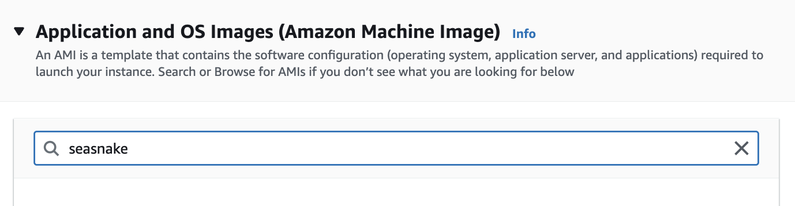
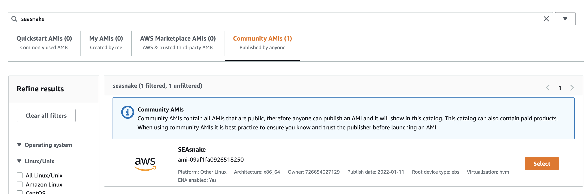
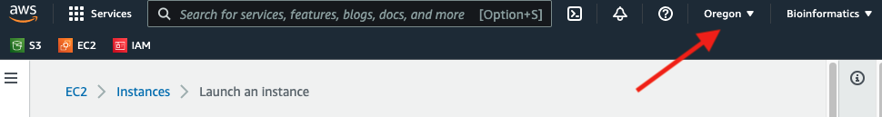
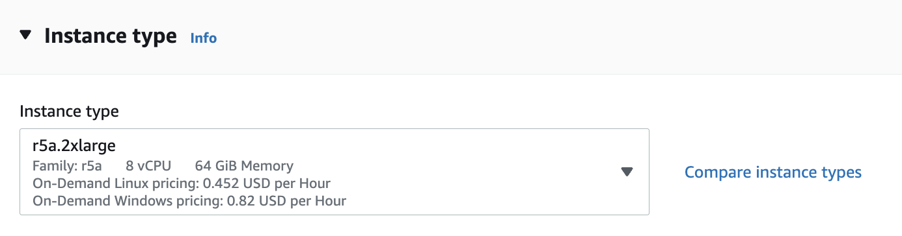
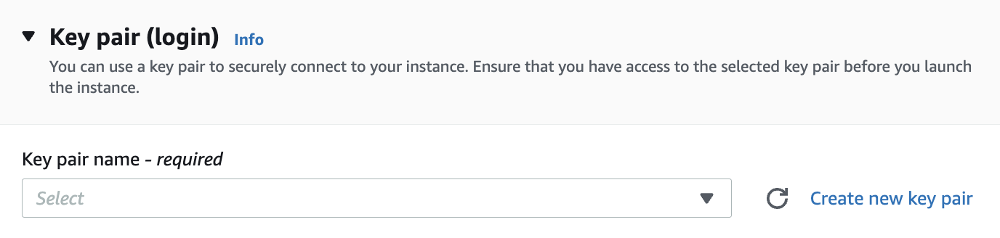
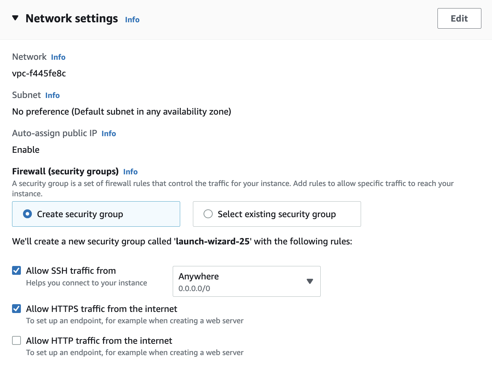
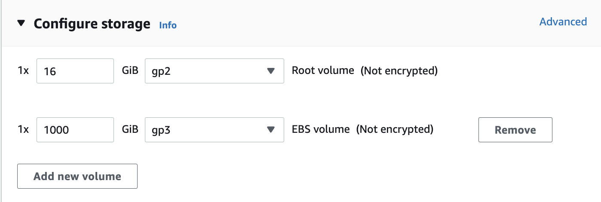

# Introduction

[SEAsnake](https://github.com/BIGslu/SEAsnake) is a [snakemake](https://snakemake.readthedocs.io/en/stable/) pipeline to process bulk RNA-seq data from fastq sequences to gene counts. It includes the following steps. You can see an in-depth example of how to run these steps separately outside SEAsnake in our [first tutorial](https://github.com/BIGslu/tutorials/blob/main/RNAseq/1.Hawn_RNAseq_fastq.to.counts.pdf).

1. Quality assess sequences with [FastQC](https://www.bioinformatics.babraham.ac.uk/projects/fastqc/)
2. Remove adapters and filter low quality sequences with [AdapterRemoval](https://adapterremoval.readthedocs.io/en/latest/)
    - max N = 1
    - min length = 15
    - min quality = 30
    - 5' and 3' adapters specified in config file
3. Align to reference genome with [STAR](https://github.com/alexdobin/STAR)
4. Quality filter alignments with [samtools](http://www.htslib.org/) `view`
    - header retained
    - paired reads where both mapped
    - min MAPQ = 30
    - remove unmapped, non-primary alignments, and PCR duplicates
5. Quality assess alignments with [samtools](http://www.htslib.org/) `flagstat` and/or [Picard](https://broadinstitute.github.io/picard/) `CollectRnaSeqMetrics`
6. Count reads in genes with [Subread](http://subread.sourceforge.net/) `featureCounts`
    - exons only
  
Here, we provide an example of how to install and run SEAsnake on human bulk RNA-seq.

# Software
## Resource requirements
### Compute {#compute}

**CPU (aka cores)**: Many of the steps in SEAsnake run in parallel. Thus, the time to run the pipeline on 2 CPUs is roughly half of 1 CPU (not counting non-parallel processes like genome indexing). Thus, you could run as many CPUs as you have fastq files. However, this may not always be recommended as there is a trade-off with RAM usage.

**RAM**: Estimating RAM usage is difficult. The most impactful values to consider are number of CPUs, fastq file size, and reference genome size. Each CPU uses equivalent RAM for parallel jobs. So 2 CPUs require twice the RAM as 1 CPU. Sample and genome size also contribute as larger files use more RAM on each CPU being run. The most common pipeline failure is running out of RAM, so when in doubt, choose the larger option.

**Our recommendation**: We follow a general rule of CPU = fastqs / 3 and RAM = CPU * 3 + 40 where each CPU gets 3 GB of RAM and there is an additional 40 GB for the genome. If your fastq are large (> 5 GB), you may need to increase the CPU factor for RAM calculation. For us, the exact number of CPUs depends on what is available on AWS, and these parameters are commonly met by `m5` instance types.

*Note that indexing the human genome requires a minimum of 40 GB of RAM, so do not go below this if you need to complete that step.*

### Storage {#storage}

**Storage**: SEAsnake itself is a small program (< 150 MB). Thus, storage needs depend almost entirely on your sample size and sequencing depth of those samples. Larger raw fastq result in larger result files.

**Our recommendation**: We recommend 25 GB per 1 fastq file plus 100 GB for the genome. This comes to roughly 1 TB for 36 fastq or 18 paired-end samples. If you are using `aws sync` to load fastq and/or reference files, these do not contribute to the storage load and can be subtracted from your estimate. Again values may need to be scaled up if your original fastq tend to be larger than 5 GB.

### Time

SEAsnake step 1 completes 1 fastq in 30 to 45 min. Since this step is run in parallel, your estimated completion time is equal to the number of fastq / CPU run in parallel * 0.75 hours. For example using our recommended compute size, if you have 40 fastq and run on 40 / 3 = 14 cores, this is 40 / 14 * 0.75 = 2.1 hours.

SEAsnake step 2 completes 1 set of paired end fastq in roughly 10 hours. Using the same example, if you have 40 fastq from 20 paired end samples running on 14 cores, this is 20 / 14 * 10 = 14.3 hours. Non-paired end samples takes about half the time.

Step 2 will take less time if you do not have adapter contamination requiring alignment in `AdapterRemoval` (- 1 hour per single fastq or paired-end sample) or if you already have an indexed reference genome for `STAR` (- 1 hour from total time).

We are working on improving speed so please check for updates periodically.

## AWS installation
### Create a SEAsnake EC2 instance

SEAsnake can be pre-installed on any AWS EC2 instance.

1. Launch a new instance from the AWS console. Search 'seasnake' and select the Community AMI SEAsnake.

{width=49%}
{width=49%}  

Make sure your in the us-west-2 (Oregon) region as noted in the upper right of the screen. Otherwise, you will not see the SEAsnake AMI.

{width=50%}  

2. Choose your instance type keeping your resource requirements in mind (see [Compute](#compute) for size recommendations). For this tutorial's data, use `r5a.2xlarge` because the sample fastq are very small. For full datasets, `m5` types is our most used instance class. 

{width=50%}  
3. Create or find a key pair you can access.

{width=50%}  

4. Allow both SSH and HTTPS access.

{width=50%}  

5. Add additional storage (see [Storage](#storage) for size recommendations). Please leave the root storage at 16 GB; this holds the underlying software.

{width=50%}  

6. Launch the instance. This will take a couple minutes to complete before you can log-in.

### Setup and install SEAsnake

Once the instance is running, log-in. Please replace the key and IP address with data for your instance.

```{bash eval=FALSE}
ssh -i PATH_TO_KEY.pem ec2-user@Public_IPv4_DNS.com
```

Then, complete setup as follows. First, define your AWS account information. Note that your `AWS_REGION` should be just the base region like `us-west-2` without any sub-letters.

```{bash eval=FALSE}
AWS_ACCESS_KEY="XXXX"
AWS_SECRET_ACCESS_KEY="XXXX"
AWS_REGION="xxxx"
```

Then, run the following script which will configure your AWS account.

```{bash eval=FALSE}
#### Basic AWS update ####
sudo yum upgrade -y
sudo yum update -y

#### Configure AWS ####
## Configure your account
export AWS_ACCESS_KEY_ID=$AWS_ACCESS_KEY
export AWS_SECRET_ACCESS_KEY=$AWS_SECRET_ACCESS_KEY
export AWS_DEFAULT_REGION=$AWS_REGION

## Setup fuse keys
echo $AWS_ACCESS_KEY:$AWS_SECRET_ACCESS_KEY > ~/.passwd-s3fs
chmod 600 ~/.passwd-s3fs
```

Next, get your EBS volume name. On most setups, this next code chunk will automatically result in the correct `ebs_name`. However, double-check the output to make sure the `echo` command results in the volume you want from the `lsblk` list. The correct one is the large one you intend to store all results on.

```{bash eval=FALSE}
#### Setup EBS volume ####
## Get addtl volume name
## If this does not give the correct volume name, find it with lsblk
ebs_name=$(lsblk -o NAME -n -i | tail -n 1)
echo $ebs_name
lsblk
```

Finally, format the additional EBS volume and install SEAsnake.

```{bash eval=FALSE}
## Format volume
sudo mkfs -t ext4 /dev/$ebs_name
## Attach SEAsnake directory to volume
sudo mkdir -p ~/SEAsnake
sudo mount /dev/$ebs_name ~/SEAsnake
## Change permissions to read-write
sudo chmod 777 -R ~/SEAsnake/
## Remove default subdir
sudo rm -R ~/SEAsnake/lost+found

## Clone SEAsnake from GitHub
git clone https://github.com/BIGslu/SEAsnake ~/SEAsnake
```

## Other linux installation

If you are not using AWS, you can install SEAsnake and its dependencies using the following scripts.

```{bash eval=FALSE}
#### Install conda ####
## Download conda
sudo mkdir -m 777 -p ~/apps/anaconda
cd ~/apps/anaconda
sudo curl -O https://repo.anaconda.com/archive/Anaconda3-2021.11-Linux-x86_64.sh

## Compile and install conda
sudo bash Anaconda3-2021.11-Linux-x86_64.sh -b -p /home/ec2-user/apps/anaconda -u
eval "$(/home/ec2-user/apps/anaconda/bin/conda shell.bash hook)"
conda init
sudo chmod 777 -R ~/apps/
```

Restart your terminal for conda initiation to take effect.

```{bash eval=FALSE}
## Configure addtl conda channels
conda config --add channels bioconda
conda config --add channels conda-forge
conda config --set allow_conda_downgrades true

#### Install mamba ####
conda install -n base -c conda-forge mamba -y --repodata-fn repodata.json

#### Install SEAsnake ####
## Install git
sudo yum install git -y

## Clone SEAsnake from GitHub
sudo mkdir -m 777 ~/SEAsnake
git clone https://github.com/BIGslu/SEAsnake ~/SEAsnake

## Create environment and install SEAsnake software with mamba
mamba env create --name SEAsnake --file ~/SEAsnake/environment/Hissss_env.yaml
```

## Update SEAsnake

If you previously installed SEAsnake, you can update it by pulling the latest version from GitHub.

```{bash eval=FALSE}
cd ~/SEAsnake
git pull
```

# SEAsnake
## fastq data

*Note: SEAsnake is only setup to run paired-end `fastq.qz` files in its `data/` directory.*

If you are using fuse to access your fastq data on S3, link your bucket to the SEAsnake `data/` directory. Note that your DATA_BUCKET name **must not** contain `.` or else fuse will not work.

```{bash eval=FALSE}
# Define the name of your data bucket
DATA_BUCKET="MY_BUCKET_NAME"
# Make directory for data
sudo mkdir -m 777 ~/SEAsnake/data
# Fuse bucket to directory
s3fs $DATA_BUCKET ~/SEAsnake/data \
    -o passwd_file=~/.passwd-s3fs \
    -o default_acl=public-read -o uid=1000 -o gid=1000 -o umask=0007
```

If you are transferring data by another method, create the `SEAsnake/data/` directory and copy your data there. For example, to run this vignette's example data.

```{bash eval=FALSE}
# Make directory for data
sudo mkdir -m 777 ~/SEAsnake/data
# Copy fastqs
cp ~/SEAsnake/vignette/data/*fastq.gz ~/SEAsnake/data
```

#### Filename requirements

SEAsnake looks for specific filenames in the `data/` directory based on default Illumina outputs. Your files must follow these rules for SEAsnake to run correctly.

* Files must be `fastq.gz` format
* Read 1 and 2 must be specified by `_R1` and `_R2` in the filename
* No other part of the filename can contain `_R1` or `_R2` including sample names
* Filenames must contain the original lane notation as `_L`. Everything before this lane number is treated as the sample name

For example, `test_S1_L005_R1_001.fastq.gz`

## Reference genome

If you are using fuse to access your STAR-formatted genome index on S3, link your bucket to the SEAsnake `ref/` directory. *Hawn/Altman labs: These are in the bucket `human-ref`.*

```{bash eval=FALSE}
# Define the name of your data bucket
REF_BUCKET="MY_BUCKET_NAME"
# Make directory for data
sudo mkdir -m 777 ~/SEAsnake/ref
# Fuse bucket to directory
s3fs $REF_BUCKET ~/SEAsnake/ref \
    -o passwd_file=~/.passwd-s3fs \
    -o default_acl=public-read -o uid=1000 -o gid=1000 -o umask=0007
```

If you do not have a pre-built index, the pipeline will make one for you!

## Run SEAsnake

Set the number of cores you would like to use. This should be no more than your total CPU - 1. Then, activate the conda environment, which contains all pre-installed software, and move into the SEAsnake directory.

```{bash eval=FALSE}
cores=15
conda activate SEAsnake
cd ~/SEAsnake
```

### Step 1

Next, run SEAsnake step 1. This completes initial sequence quality assessment, directory structure setup, and config file creation. *Note that `nohup` and piping into a log file means nothing will appear in your terminal window. This prevents timeout and retains all messages and errors in the log file.*

```{bash eval=FALSE}
nohup snakemake --snakefile Snakefile_step1 --cores $cores >> log/SEAsnake_step1.log 2>&1 &
```

Your directory structure will look like

```{r eval=TRUE, echo=FALSE, message=FALSE, fig.height=6}
#You do not need to run this. See HTML or PDF document for figure.
library(DiagrammeR)
grViz(diagram = "digraph flowchart {
  graph[rankdir = LR]
  node [fontname = arial, shape = retangle, fontsize=10, height=0.1]
  dir1 [label = '@@1']
  dir2 [label = '@@2']
  dir3 [label = '@@3']
  dir4 [label = '@@4']
  dir5 [label = '@@5']
  dir6 [label = '@@6']
  dir7 [label = '@@7']
  dir8 [label = '@@8']
  dir9 [label = '@@9']
  dir10 [label = '@@10']
  dir11 [label = '@@11']
  dir12 [label = '@@12']
  dir13 [label = '@@13']
  dir14 [label = '@@14']
  dir15 [label = '@@15']
  dir16 [label = '@@16']
  dir17 [label = '@@17']
  dir18 [label = '@@18']
  dir19 [label = '@@19']

  dir1 -> dir15,dir2,dir13,dir14;
  dir15 -> dir3,dir4,dir5,dir6,dir7,dir8;
  dir8 -> dir9,dir10,dir11,dir12;
  dir14 -> dir16,dir17;
  dir17 -> dir18,dir19;
  }
  
  [1]: 'SEAsnake/'
  [2]: 'data/'
  [3]: '1_trim/'
  [4]: '2_bam/'
  [5]: '3_bam_filter/'
  [6]: '4_count/'
  [7]: '5_combined/'
  [8]: 'qc/'
  [9]: '1_fastqc_raw/'
  [10]: '2_fastqc_trim/'
  [11]: '3_flagstat/'
  [12]: '4_picard/'
  [13]: 'log/'
  [14]: 'ref/'
  [15]: 'result/'
  [16]: 'PICARDref/'
  [17]: 'release###/'
  [18]: 'STARindex/'
  [19]: 'STARref/'
  ")
```

#### Breaking down the `snakemake` command

For those less familiar with bash scripting, here is a detailed break down of the command used to run SEAsnake in `snakemake`

* `nohup` tells the program to continue running even if you log out or close your terminal window
* `snakemake --snakefile Snakefile_step1` runs the step1 SEAsnake commands in the `snakemake` program
* `--cores $cores` distributes the process across the number of cores you specify
* `>> log/SEAsnake_step1.log 2>&1` saves all standard output and errors (what's normally printed in the terminal window as something runs) to the log file instead
* `&` pushed to process to the background so you can immediately start using other commands (like checking progress below) in the same terminal window

### Checking progress

If you want to check progress, you can see what is currently running in the log.

```{bash eval=FALSE}
tail ~/SEAsnake/log/SEAsnake_step1.log
```

Or ask SEAsnake to summarize how many tasks need to still be completed. The `-n` flag is a "dry run" where SEAsnake does not actually run anything. In addition, `--rerun-incomplete` causes SEAsnake to count processes that are not yet complete.

```{bash eval=FALSE}
cd ~/SEAsnake
conda activate SEAsnake
snakemake --snakefile ~/SEAsnake/Snakefile_step1 -n --rerun-incomplete
```

You'll see something like this. This example shows that 2 of the fastq files still need to complete FastQC.

```
Job stats:
job           count    min threads    max threads
----------  -------  -------------  -------------
all               1              1              1
fastqc_raw        2              1              1
total             3              1              1

This was a dry-run (flag -n). The order of jobs does not reflect the order of execution.
```

### Customize config

Step 1 creates `result/config.yaml` which allows some customization of the workflow. Below is an example from the vignette data with all defaults. 

```
SampleList:
   test_S1: 
    sample: 'test_S1'
    R1: 'data/test_S1_L005_R1_001.fastq.gz'
    R2: 'data/test_S1_L005_R2_001.fastq.gz'
   test_S2: 
    sample: 'test_S2'
    R1: 'data/test_S2_L005_R1_001.fastq.gz'
    R2: 'data/test_S2_L005_R2_001.fastq.gz'


# Adapter removal
## Base pairs to trim from 5' end
trim5p: 10
## Removal of 3' adapter sequences? Default are Illumina Universal adapters
trimAdapt: True
adapter1: AGATCGGAAGAGCACACGTCTGAACTCCAGTCAC
adapter2: AGATCGGAAGAGCGTCGTGTAGGGAAAGAGTGT

# Genome alignment

## Species the format 'Homo_sapiens.GRCh38' or 'Mus_musculus.GRCm39'
genome: 'Homo_sapiens.GRCh38'
## Genome release number. Current as of 2022.04.14
release: '106'

# Alignment metrics
## Run Picard?
picard: True

# Other
threads: 15
```

#### Customizaton options

You may wish to change some defaults. 

* SampleList
  - SEAsnake lists all `fastq.gz` from the `data/` directory and will run the pipeline for all of these samples. To remove a sample, simply remove the 4 lines relevant to that sample. To rename result files for a sample, change the "sample" field. 
* Adapter removal
  - `trim5p`: Number of base pairs to trim from the 5' end. You determine this from FastQC "Per base sequence content". For example, this sample appears to have disproportionately high calls up to 10 bp. This supports trimming the first 10 bp of these sequences (default).
  - {width=50%}
  - `trimAdapt`: Sequencing adapters may also exist in the data. These can be seen in FastQC "Adapter content" (below). You remove these by aligning to adapter sequences provided in the config file. Default are Illumina Universal adapters but you can provide any adapter sequence.
  - If you do not see adapter contamination, **set trimAdapt to False**! You can leave the adapter sequences as is as they will not be used with the False setting. This dramatically speeds up adapter trimming.
  - {width=50%}
* Genome alignment
  - Currently SEAsnake supports any ENSEMBL genome release. Tests have only been run for human and mouse, so please let us know how others work! 
* Alignment metrics
  - `picard`: This program provides additional alignment quality metrics listed [here](http://broadinstitute.github.io/picard/picard-metric-definitions.html#RnaSeqMetrics). If you do not need these metrics, set to False.
* `threads`
  - This sets the maximum number of threads **per job** as opposed to the SEAsnake `--cores` parameter which sets the maximum number of cores to run jobs in parallel. Thus, the total cores being used is threads * cores.
  - By default, threads is your total CPU minus 1 and is automatically scaled for each step in SEAsnake based on its individual requirements. You should not need to change this but can reduce it if you experience issues with running out of CPU or RAM space.
  - *MAC and WINDOWS*: Auto core detection does not work. Please verify that the config file contains a non-negative numeric value.
  
You can also find a more thorough introduction to quality assessment in our [first tutorial](https://github.com/BIGslu/tutorials/blob/main/RNAseq/1.Hawn_RNAseq_fastq.to.counts.pdf).

### Step 2

Run SEAsnake step 2. This completes adapter trimming, alignment, filtering, quality assessment, and exon counting.

```{bash eval=FALSE}
nohup snakemake --snakefile Snakefile_step2 --cores $cores >> log/SEAsnake_step2.log 2>&1 &
```

This step can take quite some time to run. Because of `nohup`, you can close the terminal at any time and SEAsnake will continue to run. Check in on progress in a new terminal window using the log or `-n --rerun-incomplete` flags as you did for step 1.

For example, a log

```{bash eval=FALSE}
tail ~/SEAsnake/log/SEAsnake_step2.log
```

or SEAsnake dry run

```{bash eval=FALSE}
conda activate SEAsnake
snakemake --snakefile ~/SEAsnake/Snakefile_step2 -n --rerun-incomplete
```

```
Job stats:
job               count    min threads    max threads
--------------  -------  -------------  -------------
STAR_align            2              3              3
STAR_index            1              3              3
STAR_load             1              3              3
STAR_remove           1              1              1
adapterremoval        2              1              1
align_filter          2              1              1
all                   1              1              1
combine               1              1              1
fastqc_trim           4              1              1
fcount                2              1              1
flagstat              2              1              1
picard                2              1              1
total                21              1              3

This was a dry-run (flag -n). The order of jobs does not reflect the order of execution.
```

### Save results

Once complete, save your `result/` and `log/` directories because these will be lost once your stop your EC2 instance. We recommend using `aws s3 sync` to save to an S3 bucket like so.

```{bash eval=FALSE}
RESULT_BUCKET="MY_RESULT_BUCKET"
aws s3 sync ~/SEAsnake/result/ s3://$RESULT_BUCKET
aws s3 sync ~/SEAsnake/log/ s3://$RESULT_BUCKET
```

You may also wish to save your genome index for use in future runs. This saves about an hour of run time for human samples! *Hawn/Altman labs: Save to the `human-ref` bucket.*

```{bash eval=FALSE}
aws s3 sync ~/SEAsnake/ref/* s3://human-ref
```

Then, close the conda environment.

```{bash eval=FALSE}
conda deactivate
```

And un-fuse any buckets in use.

```{bash eval=FALSE}
fusermount -u ~/SEAsnake/data
fusermount -u ~/SEAsnake/ref
```

## Example results

You main results will be in `result/5_combined/` where all samples have been combined into a single table per data type.

Counts table.

```{r message=FALSE, echo=FALSE, warning=FALSE}
library(tidyverse)
read_tsv("result/5_combined/combined_feature_counts.tsv") %>% 
  filter(test_S2 > 0 | test_S1 > 0) %>% head()
```

Flagstat alignment metrics.

```{r message=FALSE, echo=FALSE, warning=FALSE}
read_tsv("result/5_combined/combined_flagstat.tsv") %>% head()
```

Picard alignment metrics.

```{r message=FALSE, echo=FALSE, warning=FALSE}
read_tsv("result/5_combined/combined_picard.tsv") %>% head()
```

# Troubleshooting
#### Genome indexing fails

Genome indexing with STAR requires both a lot of RAM (40 GB) and storage (100 GB) for the human genome. If this step fails, check that you have enough storage with `df -h` and if not, follow the instructions below to add an EBS volume. If you do have enough storage, then it was likely a RAM issue. Decrease the RAM used for indexing by decreasing the `thread` option in the config file. Also, delete the log file from indexing (`log/benchmark/STAR_index.benchmark.txt`) or else SEAsnake won't know to rerun this step. Then, re-run the failed call with the addition of `--rerun-incomplete` to fix any files that were currently running when it crashed. For example,

```{bash eval=FALSE}
## Remove log
rm log/benchmark/STAR_index.benchmark.txt

## Rerun SEAsnake
nohup snakemake --snakefile Snakefile_step2 --cores $cores --rerun-incomplete >> log/SEAsnake_step2.log 2>&1
```

#### Running out of storage

You can see how much space is available on your instance with `df -h`. When there is no more writable space in the SEAsnake directory, you'll see errors in the log such as `No space left on device`. Since snakemake workflows decide on what to run based on the outputs already present, you need to add/create a larger volume, copy your ENTIRE SEAsnake directory to it, and re-run the failed call with the addition of `--rerun-incomplete` to fix any files that were currently running when it crashed. For example,

```{bash eval=FALSE}
## Input volume name. Can be found with lsblk
ebs_name2="NEW_VOLUME_NAME"
## Format volume
sudo mkfs -t ext4 /dev/$ebs_name2
## Attach SEAsnake directory to volume
sudo mkdir -p ~/SEAsnake2
sudo mount /dev/$ebs_name2 ~/SEAsnake2
## Change permissions to read-write
sudo chmod 777 -R ~/SEAsnake2/
## Remove default subdir
sudo rm -R ~/SEAsnake2/lost+found

## Copy previous SEAsnake data and results
## Note that if you used fuse for your data, you should unmount it, copy the SEAsnake directory, then re-establish fuse in the new SEAsnake2
cp -r ~/SEAsnake/ ~/SEAsnake2/

## Rerun SEAsnake
cd ~/SEAsnake2

nohup snakemake --snakefile Snakefile_step2 --cores $cores --rerun-incomplete >> log/SEAsnake_step2.log 2>&1
```

#### Running out of RAM 

This is the most common error and results in error messages in the log like `Out of memory` or `std::bad_alloc`. You can use less RAM by reducing the number of `--cores` in the snakemake call and re-running the step that failed with the addition of `--rerun-incomplete` to fix any files that were currently running when it crashed. For example,

```{bash eval=FALSE}
## Decrease cores
cores=10

## Rerun SEAsnake
nohup snakemake --snakefile Snakefile_step2 --cores $cores --rerun-incomplete >> log/SEAsnake_step2.log 2>&1
```

# Contribute to SEAsnake

SEAsnake is an open source workflow. We would love your feedback including error/bug reports and requests for additional features! Please let us known on our [GitHub](https://github.com/BIGslu/SEAsnake/issues). We also welcome community code additions through pull requests!

# Cite SEAsnake

Dill-McFarland KA, Benson B, Segnitz RM. 2022. SEAsnake: a pipeline for RNA-seq from fastq to counts. DOI: [10.5281/zenodo.5790287](https://github.com/BIGslu/SEAsnake)

***
